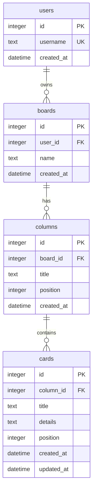

# Database design

SQLite database for the Kanban PM app. The schema supports multiple users (for the future) but the MVP uses exactly one board per user. **Implemented in Part 6** (`backend/app/models.py`, `board_service.py`). This document remains the schema reference for Part 9 (AI board updates).

## Goals

- Persist a user's Kanban board (columns + cards) across restarts.
- Match the frontend's existing in-memory shape so Part 7 wiring is minimal.
- Stay simple: no migrations framework, no soft deletes, no extra features.

## Storage and access

- Engine: SQLite, single file. Path from env `DATABASE_URL`, default `sqlite:///./data/kanban.db` (relative to the backend working dir; in Docker this is `/app/data/kanban.db`).
- The `data/` directory and the database/tables are created automatically on startup if missing (`Base.metadata.create_all`).
- Access layer: SQLAlchemy 2.0 ORM (typed models), kept minimal. No Alembic for the MVP; the schema is created once via `create_all`.
- The DB file lives on a Docker volume-friendly path (`/app/data`) so data survives container restarts (mount is optional for the MVP).

## Entity relationships



## Tables

### users
| column | type | notes |
| --- | --- | --- |
| id | INTEGER | primary key, autoincrement |
| username | TEXT | unique, not null |
| created_at | DATETIME | default now |

The MVP seeds one user, `user`. Passwords are NOT stored: authentication is hardcoded in the app (`user`/`password`) per the project spec. A `password_hash` column can be added later without affecting the rest of the schema.

### boards
| column | type | notes |
| --- | --- | --- |
| id | INTEGER | primary key, autoincrement |
| user_id | INTEGER | FK -> users.id, not null |
| name | TEXT | not null, default "My Board" |
| created_at | DATETIME | default now |

MVP: one board per user. Not enforced with a unique constraint so multiple boards are possible in the future; the app simply uses the user's first board.

### columns
| column | type | notes |
| --- | --- | --- |
| id | INTEGER | primary key, autoincrement |
| board_id | INTEGER | FK -> boards.id, not null |
| title | TEXT | not null (renameable) |
| position | INTEGER | not null, 0-based order within the board |
| created_at | DATETIME | default now |

Columns are fixed in count (5) for the MVP; only their titles change. Ordered by `position`.

### cards
| column | type | notes |
| --- | --- | --- |
| id | INTEGER | primary key, autoincrement |
| column_id | INTEGER | FK -> columns.id, not null |
| title | TEXT | not null |
| details | TEXT | not null, default "" |
| position | INTEGER | not null, 0-based order within the column |
| created_at | DATETIME | default now |
| updated_at | DATETIME | default now, updated on edit |

Foreign keys use `ON DELETE CASCADE` (deleting a column deletes its cards). SQLite foreign key enforcement is enabled via `PRAGMA foreign_keys=ON`.

## Ordering strategy

- Both `columns.position` and `cards.position` are contiguous 0-based integers within their parent.
- Moving a card: remove it from its source column, reindex the remaining source cards, insert at the destination index, reindex the destination column. Same-column moves reindex a single column.
- This is simple and correct for the small board sizes in this app; no fractional/gap indexing needed.

## ID strategy

- Database primary keys are integers (autoincrement) and are backend-owned.
- The API serializes all ids as **strings** to match the frontend's existing `BoardState` (which uses string ids like `card-1`). Example: DB `id=1` -> JSON `"1"`.
- New cards get their id from the database on creation; the frontend stops generating ids (change lands in Part 7).

## API JSON shape

`GET /api/board` returns the authenticated user's board in the exact shape the frontend reducer already uses:

```json
{
  "columns": [
    { "id": "1", "title": "Backlog", "cardIds": ["1", "2"] },
    { "id": "2", "title": "To Do", "cardIds": ["3", "4"] }
  ],
  "cards": {
    "1": { "id": "1", "title": "Research competitors", "details": "..." },
    "2": { "id": "2", "title": "Define user personas", "details": "..." },
    "3": { "id": "3", "title": "Design board layout", "details": "..." },
    "4": { "id": "4", "title": "Set up project repo", "details": "..." }
  }
}
```

- `columns` is ordered by `position`.
- Each `cardIds` array is ordered by the cards' `position` within that column.
- `cards` is a lookup map keyed by card id.

The mutation endpoints (defined in detail in Part 6) operate on this model: rename column, add card, edit card, delete card, move card.

## Seeding

On first use for a user (when the user has no board), the backend creates:
- one board named "My Board",
- the 5 fixed columns: Backlog, To Do, In Progress, Review, Done (positions 0-4),
- the 9 demo cards from the current frontend `dummyData`, distributed across the columns as they appear today,

so the persisted experience matches the current demo. After seeding, all state changes are persisted.

## Out of scope (MVP)

- Migrations (Alembic), soft deletes, audit history.
- Multiple boards per user (schema allows it; app does not use it).
- Storing credentials / password hashing (auth is hardcoded).
